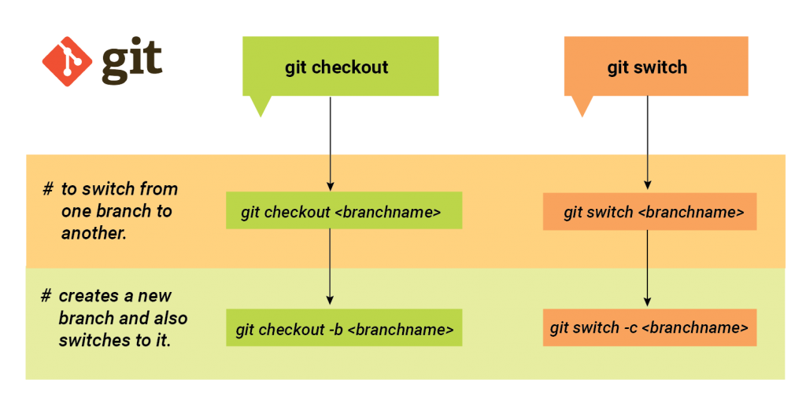
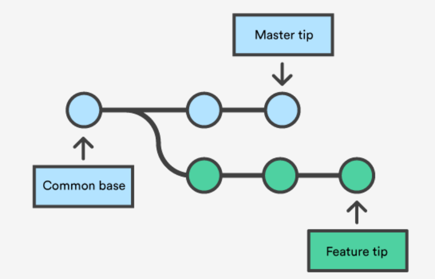
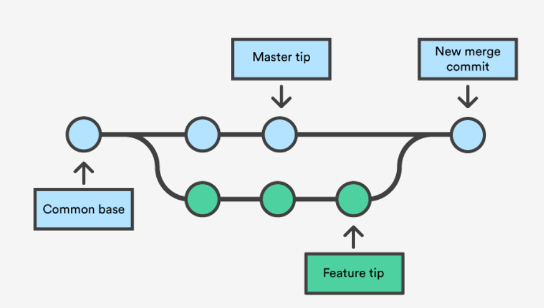

# Git Komutları

### Init
*git init* komutu git yapılandırmasını dahil eder.
### Kullanım
    $ git init
    $ git init -b <branch-name>
-----------------

### Config
*git config* komutu git ile alakalı yapılandırmaları belirlemek için kullanılır.
### Kullanım
    $ git config --global user.name "ad soyad"
    $ git config --global user.email "ornek@mail.com"
    $ git config --list
-----------------

### Status
*git status* komutu git kullanarak takip edilen dizindeki dosyaların değişikliklerini listeler.
### Kullanım
    $ git status
    $ git status -s
    $ git branch -b
-----------------

### Add
*git add* komutu değişiklik yaptığımız dosyaları commit edilmek üzere 'stage' alanına eklememizi sağlar.

### Kullanım
    $ git add .
    $ git add <file-name>
    $ git add <file-path>
    $ git restore --staged <file-name>
-----------------

### Restore
*git restore* komutu değişiklik yaptığımız dosyanın değişikliklerini geri almak için kullanılır.
### Kullanım
    $ git restore <file-name>
-----------------

### Gitignore
*.gitignore* dosyasına dizindeki istemediğimiz veya gerek duymadığımız dosyaları ekleyerek git'e gönderilmesini ve değişikliklerin takip edilmeini engellemiş oluruz.
### Kullanım
    $ touch .gitignore
    $ nano .gitignore
    $ git status
-----------------

### Commit
*git commit* komutu dosyaların o anki durumunu kaydeder ve bir referans noktası oluşturur. Proje ilerledikten sonra isterseniz commit ettiğiniz başka bir noktaya geri dönüş yapmanızı sağlar.

### Kullanım
    $ git commit -m 'this is commit message'
    $ git commit -a -m 'mesaj'
    $ git commit --amend -m 'edited commit message'

-----------------
### Tag
*git tag* komutu belirlediğimiz bir commit'i işaret eden referanslardır. 

### Kullanım
    $ git tag -a -m --list --delete -lw
    $ git tag <tag-name> 
    $ git show <tag-name>
-----------------

### Log
*git log* komutu yapmış olduğumuz commit'leri listeler.
### Kullanım
    $ git log
    $ git log --oneline
    $ git log -all
    $ git log --decorate
    $ git log --graph
    $ git config --global alias.lo 'log --all --graph --decorate --oneline'

-----------------

### Reset
*git reset* komutu bulunduğumuz branch ile ilerideki veya gerideki bir commit'e gitmeyi sağlar.

### Kullanım 
    $ git reset <commit-hash>
    $ git reset --soft HEAD~1
    $ git reset --hard HEAD~3
    $ git reflog
    $ git reset -i HEAD~4
-----------------

### Revert
*git revert* komutu bir commit'te yaptığımız değişiklikleri iptal edip bu işlemi yaptığınıza dair yeni bir commit oluşturur.

### Kullanım
    $ git revert <commit-hash>

-----------------

### Branch
*git branch* bir projede dallanmayı sağlar. Bir projede birden fazla kişi çalışırken kullanılması gerekir.

### Kullanım
    $ git branch <new_branch>
    $ git checkout <new_branch>
    $ git branch -d <branch-name>
    $ git branch -M <new_branch>

-----------------

### Checkout ve Switch
*git checkout* komutu branch'ler arasında geçiş yapmamızı ve istediğimiz bir commit'e gidip dosyaların o anki durumunu görmemizi sağlar.

### Kullanım
    $ git checkout <commit-hash>
    $ git checkout <branch-name>
    $ git switch <branch-name>

-----------------

### Diff
*git diff* komutu bir dosyadaki farklılıkları görmek için kullanılır.
### Kullanım
    $ git diff
    $ git diff <file-name>
    $ git diff <commit-hash> <commit-hash>
    $ git diff <branch-name> <branch-name>
    $ git diff <branch-name> <branch-name> <file-name>

-----------------

### Merge
*git merge* komutu branchleri birleştirmek için kullanılır. Conflict meydana geldiğinde bunun çözülmesi kullanıcının sorumluluğundadır.

### Kullanım
    $ git merge <branch-name>
    $ git merge --continue
    $ git merge --abort

-----------------

### Rebase
*git rebase* komutunu kullandığımızda A branchindeki her bir commit B dalına sanki commit işlemi B dalında yapılmış gibi yeniden yazılır.

### Kullanım
    $ git rebase <branch-name>

-----------------
### Remote
*git remote* yerel depo ile takip edilen uzak depoyu kontrol edebilmeyi sağlar.

### Kullanım
    $ git remove -v 
    $ git remote add <remote-name> <remote-url>
    $ git remote remove <remote-name>
    $ git remote set-url origin git@github.com:USERNAME/REPOSITORY.git.

-----------------
### Clone
*git clone* Github'da varolan bir depoyu tüm dosyalar, dallar dahil olmak üzere klonlar(indirir).
### Kullanım
    $ git clone <remote-url>

-----------------

### Pull
*git pull* içerisinde bulunulan branch'in remote reposundaki değişikler ile bütün commitleri alarak günceller.
### Kullanım
    $ git pull
    $ git pull --rebase
    $ git pull --force
    $ git pull --all

-----------------

### Push
*git push* lokal branchteki commitleri remote repoya yükler.
### Kullanım
    $ git push -u <remote-name> <branch-name>
    $ git push --all
    $ git push --tags
    
-----------------

### Git Workflow

-----------------

### Kaynaklar
- https://www.atlassian.com/git/tutorials
- https://www.youtube.com/playlist?list=PLkEZWD8wbltmcZQaA0ism9k2E6MGRnHZ7
- https://www.youtube.com/watch?v=mYjZtU1-u9Y&list=PL1F56EA413018EEE1
- https://www.youtube.com/watch?v=jLWZaFzPS6Q
- https://www.youtube.com/watch?v=oFYyTZwMyAg
- https://www.youtube.com/watch?v=BF2OHMM86Ik
- https://www.youtube.com/watch?v=k5D37W6h56o
- https://www.youtube.com/watch?v=jhtbhSpV5YA
- https://www.youtube.com/watch?v=vIp3Uz4DG2c
- https://www.youtube.com/watch?v=1SXpE08hvGs
- https://www.youtube.com/watch?v=aJnFGMclhU8
- https://www.youtube.com/watch?v=ww4xpcvzLHc
